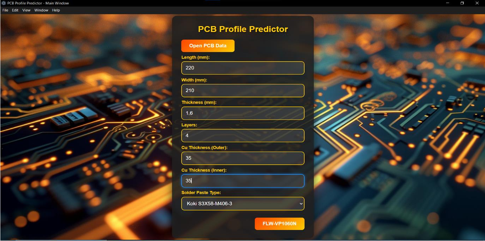
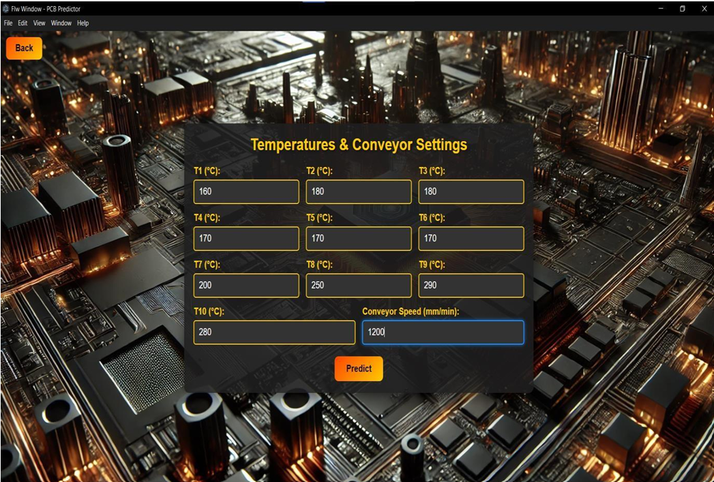
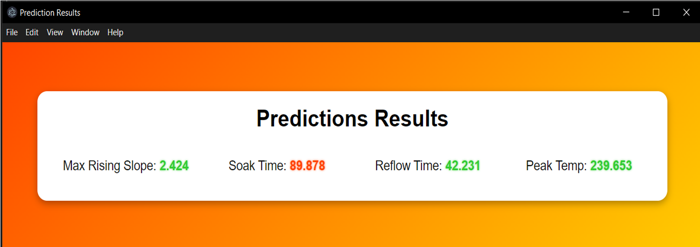

# AI-Based Reflow Oven Profile Predictor 🔥

A **desktop application** that uses machine learning to predict optimal reflow oven parameters (Max Rising Slope, Soak Time, Reflow Time, Peak Temp) for PCB manufacturing.  
*Built with Python, Electron.js, and TensorFlow.*

---

## 🖥️ **UI Screenshots**
### **1. Main Window**
Input PCB dimensions, layers, and solder paste type.  


### **2. FLW Window**
Enter temperature profiles (T1–T10) and conveyor speed.  


### **3. Prediction Window**
AI-generated predictions with color-coded results (✅ optimal / ❌ out-of-range).  


---

## 🛠️ **Tech Stack**
- **Frontend**: Electron.js (HTML/CSS/JS)  
- **Backend**: Python Flask + TensorFlow/Keras  
- **Data Tools**: Pandas, OpenPyXL  

---

## 🚀 **Features**
✔ **Automates** reflow oven calibration (no more trial-and-error).  
✔ **Cross-platform** (Windows/macOS/Linux).  
✔ **Excel integration** for quick PCB data edits.  

---

## 📥 **Installation**
1. Clone the repo:
   ```bash
   git clone https://github.com/VisalChathuranga/AI-Based-Desktop-Application-for-Reflow-Oven-Profile-Predictor.git

## **Install dependencies**
cd python_backend && pip install -r requirements.txt
cd ../frontend && npm install

## **Run**
npm start